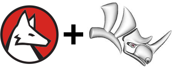

# RhinoLink for Wolfram Language

RhinoLink is a prototype Wolfram Language paclet that provides a two-way communication link between McNeel and Associates' [Rhino](https://www.rhino3d.com/) and [Mathematica](http://www.wolfram.com/mathematica/) or [Wolfram Desktop](https://www.wolfram.com/desktop/). With RhinoLink you can:

* script Rhino with Wolfram Language code
* create Grasshopper components that encapsulate Wolfram Language code
* control Rhino content with Wolfram Language interfaces
* source Rhino geometry from Mathematica
* include Wolfram Language code directly in Grasshopper structures
* use Rhino as a geometry server from Wolfram Language

RhinoLink currently supports Rhino 6 for Windows and Mathematica versions 11.0+.

### Installing the RhinoLink release

The RhinoLink release comes in the form of a `.paclet` file, which contains the entire package and its documentation. Download the latest release from the [GitHub repo's releases page](https://github.com/WolframResearch/RhinoLink/releases). To permanently install the RhinoLink paclet, run the following commands in the Wolfram Language:

    PacletInstall["/full/path/to/RhinoLink.paclet"]
    <<RhinoLink`
    InstallRhinoPlugin[]

### Using RhinoLink

To use RhinoLink, start Rhino and evaluate "WolframConnect". That will start a special kernel named "RhinoAttach" that provides communication services between Rhino and Mathematica. To use RhinoLink functions in a Wolfram Language notebook, you must set the notebook's kernel to RhinoAttach using Evaluation > Notebook's Kernel.

To get an overview of RhinoLink functionality, search for RhinoLink in the help browser, which should bring up the RhinoLink guide page. The guide page contains links to documentation of all RhinoLink function as well as links to tutorials to help get you started.

Start with the "Control a Parametric Surface in Rhino with a Manipulate Interface in Mathematica" or "Create Box Structures in Rhino with an Interface in Mathematica" tutorials to see how to use RhinoLink with Rhino. For a basic example of creating a Grasshopper component, start with "Make a Grasshopper Component that Translates Graphics3D Output to Rhino Meshes". The basics of .NET programming with Wolfram Language are explained in the "Use NETLink to Examine and Create Objects in Rhino" tutorial.

### Who is behind this?

RhinoLink is maintained by [Christopher Carlson](https://github.com/carlsongithub) and Todd Gayley of [Wolfram Research](http://wolfram.com/). Todd created RhinoLink on top of his [.NET/Link](http://reference.wolfram.com/language/NETLink/tutorial/Overview.html) package, and Chris created the examples, RhinoLink utilities, and documentation.

### How can you help?

The 0.9 release of RhinoLink has a basic set of utilities that convert between Rhino and Wolfram Language data types. The richer that set, the more useful RhinoLink will become. We welcome contributions from outside developers. 

### Further information

See the following files for more information:

* [COPYING.md](COPYING.md) - RhinoLink license
* [CONTRIBUTING.md](CONTRIBUTING.md) - Guidelines for contributing to RhinoLink
* [BUILDING.md](BUILDING.md) - Instructions for building and debugging RhinoLink
